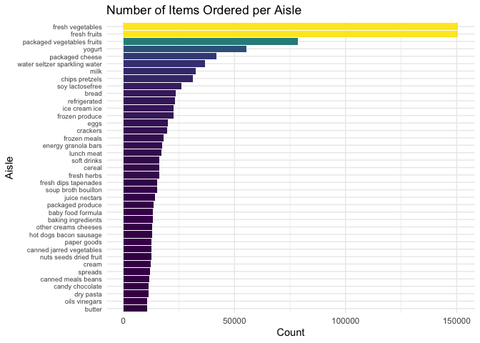

Homework 3
================
Matthew T. Russell
10/20/2021

# Problem 1

##### Load Instacart data

``` r
data("instacart")

instacart <-
  instacart %>% 
  mutate(
    order_dow = order_dow + 1,
    order_dow = wday(order_dow, label = T)  
    )
```

There are 1384617 observations and 15 in the `instacart` data where each
observation represents a product that was purchased as part of an
Instacart order. Key variables include:

*`reordered`: binary variable indicating if a user has ordered the
product in the past  
*`order_dow`: the day of the week the order was placed  
*`order_hour_of_day`: the hour the order was placed  
*`days_since_prior_order`: the number of days since the user placed
their last order with the maximum being 30 and NA if it’s the user’s
first order

##### Illustrative examples

###### Bar plot: products ordered by dept

``` r
dept_products_total <-
  instacart %>% 
  group_by(department) %>% 
  summarize(
    n_obs = n()
  ) %>% 
  arrange(desc(n_obs)) %>% 
  filter(department != 'missing')

dept_less_100k_plot <- 
  dept_products_total %>% 
  filter(n_obs < 100000) %>% 
  ggplot(aes(x = reorder(department, n_obs), y = n_obs)) +
    geom_bar(stat = "identity") + 
    xlab("Department") + ylab("Count") +
    scale_y_continuous(breaks = c(0, 20000, 40000, 60000, 80000),
      labels = c("0", "20k", "40k", "60k", "80k")) +
    coord_flip() 

dept_ge_100k_plot <-
  dept_products_total %>% 
  filter(n_obs >= 100000) %>% 
  ggplot(aes(x = reorder(department, n_obs), y = n_obs)) +
    geom_bar(stat = "identity") + 
    xlab("Department") + ylab("Count") +
    scale_y_continuous(breaks = c(0, 100000, 200000, 300000, 400000),
      labels = c("0", "100k", "200k", "300k", "400k")) +
    coord_flip()

(dept_ge_100k_plot + dept_less_100k_plot) +
  plot_annotation(
    title = 'Total products ordered by department'
    )
```


The five departments with the most purchased products are produce, dairy
eggs, snacks, beverages, frozen, and the five departments with the least
purchased products are international, alcohol, pets, other, bulk.

###### Number of orders by time of day and day of week

``` r
order_time_by_day <-
  instacart %>% 
    select(order_id, order_dow, order_hour_of_day) %>% 
    distinct %>% 
    mutate(
      time_of_day =
        ifelse(order_hour_of_day %in% 5:11, "morning", 
          ifelse(order_hour_of_day %in% 12:16, "afternoon", 
            ifelse(order_hour_of_day %in% 17:20, "evening", "night")
          )
        ) %>% 
      factor(levels = c("morning", "afternoon", "evening", "night"))
      ) %>% 
    group_by(time_of_day, order_dow) %>% 
    summarize(
      n_orders = n()
    ) %>% 
    arrange(desc(n_orders))

total_orders_per_day <-
  order_time_by_day %>% 
  group_by(order_dow) %>% 
  summarize(
    total_orders = sum(n_orders)
  ) %>% 
  arrange(desc(total_orders))

order_time_by_day %>% 
  ggplot(aes(x = order_dow, y = n_orders , fill = time_of_day)) +
    geom_col() +
    xlab("Day of Week") + ylab("Order Count") +
    labs(fill = "Time of Day")
```


To find out how many orders were placed at each time of day, I
considered 5 AM to 11 AM morning, 12 PM to 4 PM afternoon, 5 PM to 8 PM
evening, and 9 PM to 4 AM night. The day with the most orders overall
was Sun. with 27465 orders, and the day with the least orders overall
was Wed. with 15687 orders. The most popular time to place an order was
Sun. afternoon with 12186 orders placed, and the least popular time to
place an order was Wed. night with 1105 orders placed.

#### How many aisles are there, and which aisles are the most items ordered from?

``` r
aisles <-
  instacart %>% 
    count(aisle, name = "total_items_ordered", sort = T)
```

There are 134 aisles in the `instacart` data. The top five aisles
ordered from are fresh vegetables, fresh fruits, packaged vegetables
fruits, yogurt, packaged cheese.

##### Make a plot that shows the number of items ordered in each aisle, limiting this to aisles with more than 10000 items ordered. Arrange aisles sensibly, and organize your plot so others can read it.

``` r
aisles %>% 
  filter(total_items_ordered > 10000) %>% 
  ggplot(aes(x = reorder(aisle, total_items_ordered), y = total_items_ordered)) +
    geom_bar(stat = "identity", colour = "black", fill = "white") + 
    xlab("Aisle") + ylab("Count") +
    theme(axis.text.y = element_text(size = 7)) +
    coord_flip()
```



##### Make a table showing the three most popular items in each of the aisles “baking ingredients”, “dog food care”, and “packaged vegetables fruits”. Include the number of times each item is ordered in your table.

``` r
instacart %>% 
  filter(aisle %in% c("baking ingredients", "dog food care", "packaged vegetables fruits")) %>% 
  count(aisle, product_name, name = "qty_purchased") %>% 
  arrange(desc(qty_purchased)) %>% 
  group_by(aisle) %>% 
  slice(1:3) %>% 
  kable(caption = 
          "Three Most Popular Items in Baking Ingredients, Dog Food Care, and Packaged Fruits &
           Veggies Aisles")
```

| aisle                      | product\_name                                 | qty\_purchased |
|:---------------------------|:----------------------------------------------|---------------:|
| baking ingredients         | Light Brown Sugar                             |            499 |
| baking ingredients         | Pure Baking Soda                              |            387 |
| baking ingredients         | Cane Sugar                                    |            336 |
| dog food care              | Snack Sticks Chicken & Rice Recipe Dog Treats |             30 |
| dog food care              | Organix Chicken & Brown Rice Recipe           |             28 |
| dog food care              | Small Dog Biscuits                            |             26 |
| packaged vegetables fruits | Organic Baby Spinach                          |           9784 |
| packaged vegetables fruits | Organic Raspberries                           |           5546 |
| packaged vegetables fruits | Organic Blueberries                           |           4966 |

Three Most Popular Items in Baking Ingredients, Dog Food Care, and
Packaged Fruits & Veggies Aisles

##### Make a table showing the mean hour of the day at which Pink Lady Apples and Coffee Ice Cream are ordered on each day of the week

``` r
  instacart %>% 
    filter(product_name %in% c(
      "Pink Lady Apples", "Coffee Ice Cream"
    )) %>% 
    group_by(product_name, order_dow) %>% 
    summarize(mean_time = mean(order_hour_of_day)) %>%
    mutate(
      mean_time = (mean_time*3600) %>% 
      seconds_to_period() %>% 
      hms(), 
      mean_time = period(
        second = round(second(mean_time), 0), 
        minute = minute(mean_time), 
        hour = hour(mean_time)
        ), 
      mean_time = as.POSIXct(mean_time, format = "%H:%M:%S", origin = lubridate::origin, tz = "UTC"), 
      mean_time = format(mean_time, "%I:%M:%S %p")
      ) %>% 
    pivot_wider(
      names_from = "order_dow", 
      values_from = "mean_time"
    ) %>% 
    kable(caption = "Average Time Coffee Ice Cream & Pink Lady Apples are Ordered per Day of Week")
```

| product\_name    | Sun         | Mon         | Tue         | Wed         | Thu         | Fri         | Sat         |
|:-----------------|:------------|:------------|:------------|:------------|:------------|:------------|:------------|
| Coffee Ice Cream | 01:46:27 PM | 02:18:57 PM | 03:22:51 PM | 03:19:05 PM | 03:13:03 PM | 12:15:47 PM | 01:50:00 PM |
| Pink Lady Apples | 01:26:28 PM | 11:21:36 AM | 11:42:08 AM | 02:15:00 PM | 11:33:06 AM | 12:47:04 PM | 11:56:15 AM |

Average Time Coffee Ice Cream & Pink Lady Apples are Ordered per Day of
Week

# Problem 2

##### Load BRFSS and clean data

``` r
data("brfss_smart2010")

brfss <-
  brfss_smart2010 %>% 
  janitor::clean_names() %>% 
  rename(
    state = locationabbr,
    county = locationdesc
  ) %>% 
  filter(
    topic == "Overall Health"
  ) %>% 
  select(!(
    c(class, topic, display_order, data_value_unit, data_value_type, 
      data_value_footnote_symbol, data_source, class_id, topic_id, location_id,
      question_id, respid, geo_location
    )
  )) %>%
  mutate(
    county = str_remove_all(county, "^\\w\\w - ") %>% 
      str_remove_all(" County$"), 
    response = factor(
      response, ordered = T, levels = c(
        "Poor", "Fair", "Good", "Very good", "Excellent"
      )
    )
  )
```

###### In 2002, which states were observed at 7 or more locations? What about in 2010?

``` r
brfss %>% 
  filter(year == 2002) %>% 
  select(state, county) %>% 
  distinct() %>% 
  count(state) %>% 
  filter(n >= 7) %>% 
  arrange(desc(n)) %>% 
  kable(caption = "States observed 7 or more times, 2002")
```

| state |   n |
|:------|----:|
| PA    |  10 |
| MA    |   8 |
| NJ    |   8 |
| CT    |   7 |
| FL    |   7 |
| NC    |   7 |

States observed 7 or more times, 2002

``` r
brfss %>% 
  filter(year == 2010) %>% 
  select(state, county) %>% 
  distinct() %>% 
  count(state) %>% 
  filter(n >= 7) %>% 
  arrange(desc(n)) %>% 
  kable(caption = "States observed 7 or more times, 2010")
```

| state |   n |
|:------|----:|
| FL    |  41 |
| NJ    |  19 |
| TX    |  16 |
| CA    |  12 |
| MD    |  12 |
| NC    |  12 |
| NE    |  10 |
| WA    |  10 |
| MA    |   9 |
| NY    |   9 |
| OH    |   8 |
| CO    |   7 |
| PA    |   7 |
| SC    |   7 |

States observed 7 or more times, 2010

###### Spaghetti plot of average data\_value over time among ‘Excellent’ responses:

``` r
brfss %>% 
  filter(response == "Excellent") %>% 
  select(year, state, data_value) %>% 
  group_by(year, state) %>% 
  summarize(mean_data = mean(data_value)) %>% 
  ggplot(aes(x = year, y = mean_data, group = state)) +
    geom_line() +
    xlab("Year") + ylab("Mean Data Value")
```


##### Make a two-panel plot showing, for the years 2006, and 2010, distribution of data\_value for responses (“Poor” to “Excellent”) among locations in NY State.

``` r
brfss %>% 
  filter(year %in% c(2006, 2010) & state == "NY") %>% 
  ggplot(aes(x = data_value, fill = response)) +
    geom_density(alpha = .5) +
    xlab("Data Value") +
    theme(
      legend.position = "bottom",
      axis.title.y = element_blank()
          ) + 
    labs(fill = "Response") +
    facet_grid(rows = vars(year), switch = "y")
```


