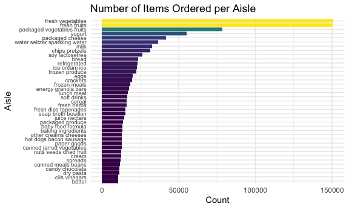

Homework 3
================
Matthew T. Russell
10/20/2021

# Problem 1

###### EDA of Instacart data

-   size and structure of the dataset
-   description of key variables
-   give illustrative examples of observations

``` r
data("instacart")


instacart <-
  instacart %>% 
  mutate(
    order_dow = order_dow + 1,
    order_dow = wday(order_dow, label = T)
  )

instacart %>% 
  janitor::clean_names() %>%
  group_by(department) %>% 
  summarize(
    n_obs = n()
  ) %>% 
  arrange(desc(n_obs))
```

    ## # A tibble: 21 × 2
    ##    department       n_obs
    ##    <chr>            <int>
    ##  1 produce         409087
    ##  2 dairy eggs      217051
    ##  3 snacks          118862
    ##  4 beverages       114046
    ##  5 frozen          100426
    ##  6 pantry           81242
    ##  7 bakery           48394
    ##  8 canned goods     46799
    ##  9 deli             44291
    ## 10 dry goods pasta  38713
    ## # … with 11 more rows

###### How many aisles are there, and which aisles are the most items ordered from?

``` r
aisles <-
  instacart %>% 
    count(aisle, name = "total_items_ordered", sort = T)
```

There are 134 aisles in the `instacart` data. The top five aisles
ordered from are fresh vegetables, fresh fruits, packaged vegetables
fruits, yogurt, packaged cheese.

###### Make a plot that shows the number of items ordered in each aisle, limiting this to aisles with more than 10000 items ordered. Arrange aisles sensibly, and organize your plot so others can read it.

``` r
aisles %>% 
  filter(total_items_ordered > 10000) %>% 
  ggplot(aes(x = reorder(aisle, total_items_ordered), y = total_items_ordered)) +
  geom_bar(stat = "identity", colour = "black", fill = "white") + 
  xlab("Aisle") + ylab("Count") +
  coord_flip()
```

<!-- -->

###### Make a table showing the three most popular items in each of the aisles “baking ingredients”, “dog food care”, and “packaged vegetables fruits”. Include the number of times each item is ordered in your table.

``` r
instacart %>% 
  filter(aisle %in% c("baking ingredients", "dog food care", "packaged vegetables fruits")) %>% 
  count(aisle, product_name, name = "qty_purchased") %>% 
  arrange(desc(qty_purchased)) %>% 
  group_by(aisle) %>% 
  slice(1:3) %>% 
  kable(caption = 
          "Three Most Popular Items in Baking Ingredients, Dog Food Care, and Packaged Fruits &
           Veggies Aisles")
```

| aisle                      | product\_name                                 | qty\_purchased |
|:---------------------------|:----------------------------------------------|---------------:|
| baking ingredients         | Light Brown Sugar                             |            499 |
| baking ingredients         | Pure Baking Soda                              |            387 |
| baking ingredients         | Cane Sugar                                    |            336 |
| dog food care              | Snack Sticks Chicken & Rice Recipe Dog Treats |             30 |
| dog food care              | Organix Chicken & Brown Rice Recipe           |             28 |
| dog food care              | Small Dog Biscuits                            |             26 |
| packaged vegetables fruits | Organic Baby Spinach                          |           9784 |
| packaged vegetables fruits | Organic Raspberries                           |           5546 |
| packaged vegetables fruits | Organic Blueberries                           |           4966 |

Three Most Popular Items in Baking Ingredients, Dog Food Care, and
Packaged Fruits & Veggies Aisles

Make a table showing the mean hour of the day at which Pink Lady Apples
and Coffee Ice Cream are ordered on each day of the week; format this
table for human readers (i.e. produce a 2 x 7 table).
